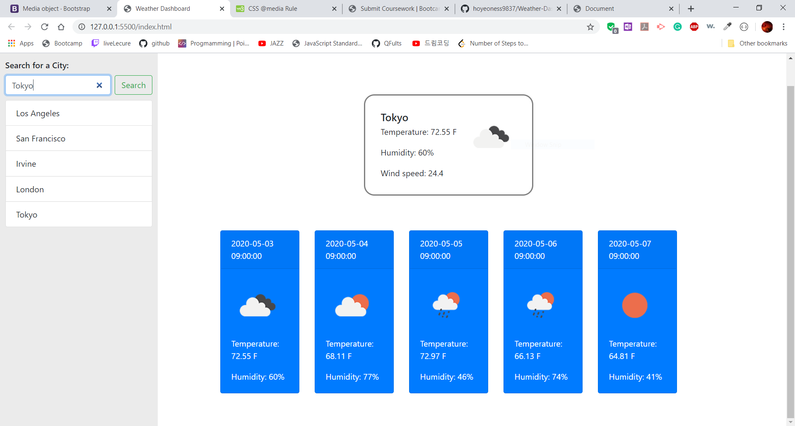

# App Description

User searches city of planning destination for the trip, It will display information about today's and 5 days weather forecast. and will also show a list of what user has searched.

## Technologies Included

- HTML, CSS, JavaScript

## Installation

Go to the following deployed link and enjoy this app! or clone the code from the repository and start the app
use VS code and open index.html file in Chrome browser.

## DEMO

## Github Repo

- [https://github.com/hoyeoness9837/Weather-Dashboard/](https://github.com/hoyeoness9837/Weather-Dashboard/)

## Deployed URL

- [https://hoyeoness9837.github.io/Weather-Dashboard/](https://hoyeoness9837.github.io/Weather-Dashboard/)
